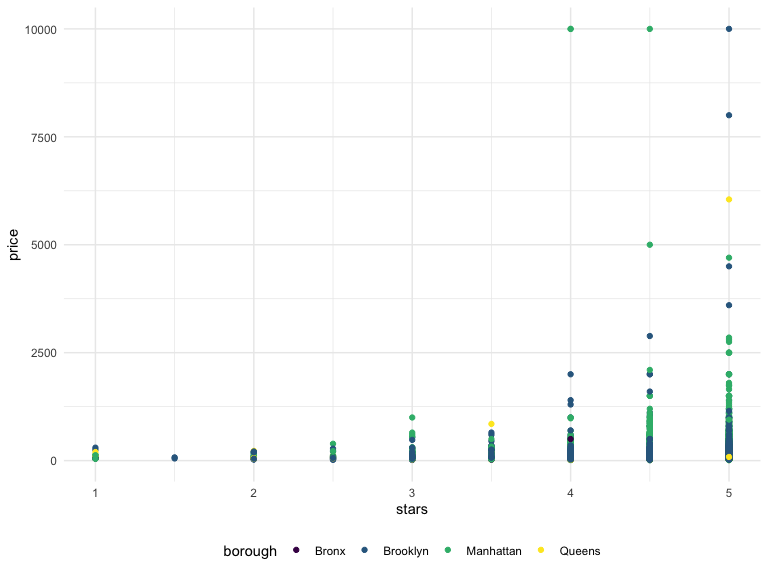
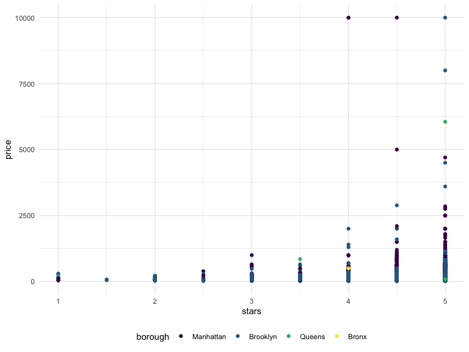

Linear Regression
================

``` r
data("nyc_airbnb")

nyc_airbnb = 
  nyc_airbnb %>%
  mutate(stars = review_scores_location/2) %>%
  rename (
    borough = neighbourhood_group,
    neighborhood = neighbourhood) %>%
  filter(borough !="Staten Island") %>%
  select(price, stars, borough, neighborhood, room_type)
```

## fit a model

``` r
nyc_airbnb %>%
  ggplot(aes(x=stars, y =price, color = borough)) +
  geom_point()
```


fit the model we care about:

let’s look at the results better using broom \*Bronx as the reference
group

``` r
broom::glance(fit)
```

    ## # A tibble: 1 x 12
    ##   r.squared adj.r.squared sigma statistic   p.value    df  logLik    AIC    BIC
    ##       <dbl>         <dbl> <dbl>     <dbl>     <dbl> <dbl>   <dbl>  <dbl>  <dbl>
    ## 1    0.0342        0.0341  182.      271. 6.73e-229     4 -2.02e5 4.04e5 4.04e5
    ## # … with 3 more variables: deviance <dbl>, df.residual <int>, nobs <int>

``` r
#dataframe of coefficients
broom::tidy(fit) %>%
  select(-std.error, -statistic) %>%
  mutate(
    term = str_replace(term,"borough", "Borough: ") #change from borough to capital Borough:
  ) %>%
  knitr :: kable(digits =3)
```

| term               | estimate | p.value |
| :----------------- | -------: | ------: |
| (Intercept)        | \-70.414 |   0.000 |
| stars              |   31.990 |   0.000 |
| Borough: Brooklyn  |   40.500 |   0.000 |
| Borough: Manhattan |   90.254 |   0.000 |
| Borough: Queens    |   13.206 |   0.145 |

## Be in control of factors

changing the reference group to Manhattan (the one with the most common
airbnb units)

``` r
nyc_airbnb =
  nyc_airbnb %>%
  mutate(
    borough = fct_infreq(borough), #factor in order of frequency of borough
    room_type= fct_infreq(room_type) #frequency of roomtype
)
```

and the plot again

``` r
nyc_airbnb %>%
  ggplot(aes(x=stars, y =price, color = borough)) +
  geom_point()
```



``` r
fit = lm(price ~ stars +borough, data= nyc_airbnb)

broom::tidy(fit)
```

    ## # A tibble: 5 x 5
    ##   term            estimate std.error statistic   p.value
    ##   <chr>              <dbl>     <dbl>     <dbl>     <dbl>
    ## 1 (Intercept)         19.8     12.2       1.63 1.04e-  1
    ## 2 stars               32.0      2.53     12.7  1.27e- 36
    ## 3 boroughBrooklyn    -49.8      2.23    -22.3  6.32e-109
    ## 4 boroughQueens      -77.0      3.73    -20.7  2.58e- 94
    ## 5 boroughBronx       -90.3      8.57    -10.5  6.64e- 26

``` r
broom::glance(fit)
```

    ## # A tibble: 1 x 12
    ##   r.squared adj.r.squared sigma statistic   p.value    df  logLik    AIC    BIC
    ##       <dbl>         <dbl> <dbl>     <dbl>     <dbl> <dbl>   <dbl>  <dbl>  <dbl>
    ## 1    0.0342        0.0341  182.      271. 6.73e-229     4 -2.02e5 4.04e5 4.04e5
    ## # … with 3 more variables: deviance <dbl>, df.residual <int>, nobs <int>

## Diagnostics

## Hypothesis tests

reference group : manhattan

``` r
fit %>%
  broom::tidy()
```

    ## # A tibble: 5 x 5
    ##   term            estimate std.error statistic   p.value
    ##   <chr>              <dbl>     <dbl>     <dbl>     <dbl>
    ## 1 (Intercept)         19.8     12.2       1.63 1.04e-  1
    ## 2 stars               32.0      2.53     12.7  1.27e- 36
    ## 3 boroughBrooklyn    -49.8      2.23    -22.3  6.32e-109
    ## 4 boroughQueens      -77.0      3.73    -20.7  2.58e- 94
    ## 5 boroughBronx       -90.3      8.57    -10.5  6.64e- 26

the significane of “borough”

``` r
fit_null = lm(price ~ stars, data =nyc_airbnb)
fit_alt = lm(price ~stars + borough, data=nyc_airbnb)
#compare the two models
anova(fit_null,fit_alt) %>%
  broom::tidy()
```

    ## # A tibble: 2 x 6
    ##   res.df         rss    df     sumsq statistic    p.value
    ##    <dbl>       <dbl> <dbl>     <dbl>     <dbl>      <dbl>
    ## 1  30528 1030861841.    NA       NA        NA  NA        
    ## 2  30525 1005601724.     3 25260117.      256.  7.84e-164
